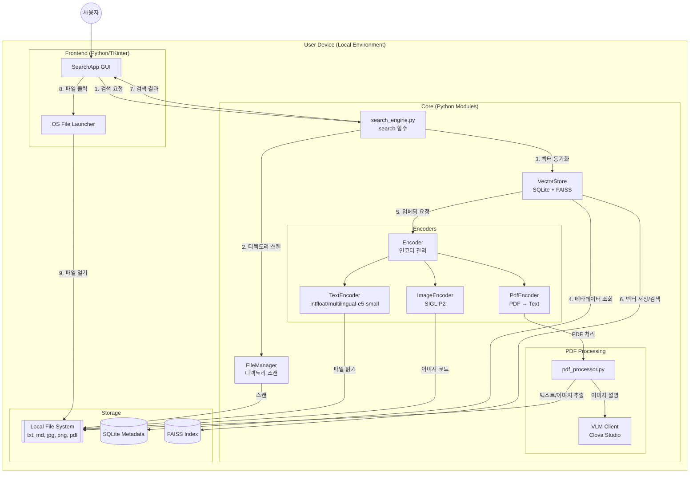
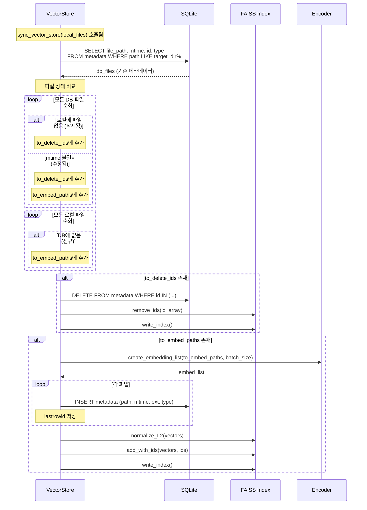
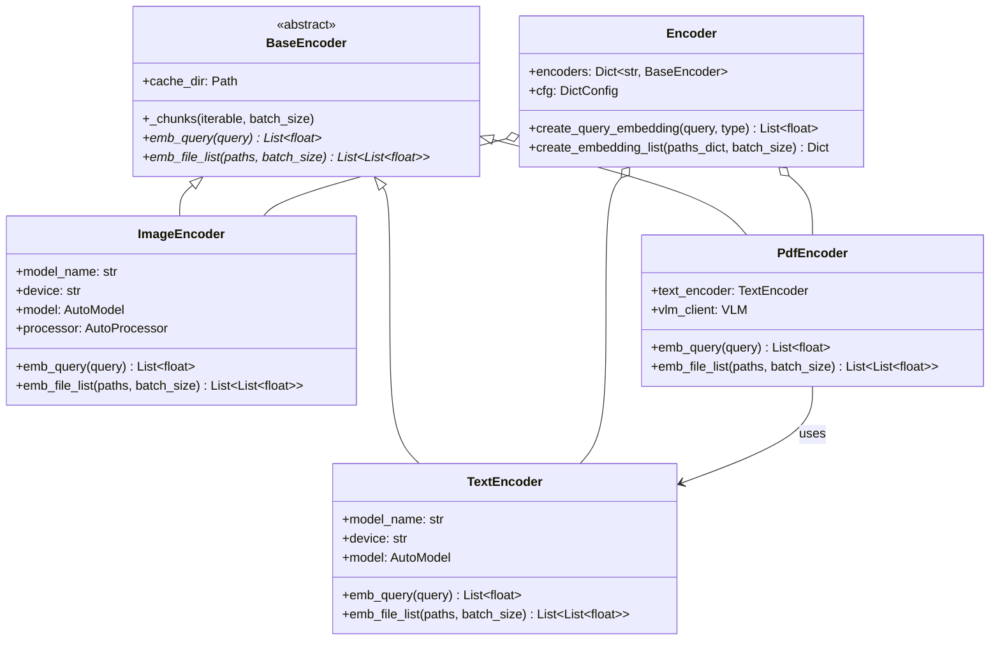

## 🐉 MIR (미르): Multimodal Intelligent Retriever

>  Naver Boostcamp AI Tech 8기 NLP트랙 최종 프로젝트

## 👀 프로젝트 소개
<b>MIR</b>는 로컬 환경의 텍스트, 이미지, PDF 데이터를 통합 관리하고 자연어 쿼리로 검색할 수 있는 프라이버시 중심의 <b>멀티모달 지능형 검색 서비스</b>입니다.
고성능 멀티모달 모델을 활용하여 사용자의 로컬 환경 내에 존재하는 이종 데이터 간의 <b>의미론적 연결을 파악</b>하고 통합 검색을 수행하는 엔진을 구축하는 것을 목표로 합니다. <br>특히 클라우드 기반이 아닌 <b>로컬 환경</b>에서의 구동을 지향하여, 개인의 민감한 사진이나 기업의 대외비 문서 등 프라이버시가 중요한 데이터에 대해 외부 유출 없는 안전한 인덱싱 및 검색 환경을 제공하고자 합니다.

## ⏲ 프로젝트 진행
◼ 프로젝트 기간
> 2026년 1월 29일 - 2026년 2월 8일 

◼ 개발 환경
> <b>하드웨어 및 서버:</b> NVIDIA V100 GPU 3대 <br>
<b>개발 언어 및 프레임워크:</b> Python, Pytorch, Huggingface Transformers, Python Tkinter <br>
<b>협업 및 관리 도구:</b> GitHub, Zoom, Slack <br>
<b>데이터 처리:</b> Clova Studio (데이터 캡셔닝 및 전처리 보조)

## 👨‍💻역할 분담
|팀원|역할|GitHub|
|--|--|--|
|<b>박제혁|팀 리딩, encoder 구조 설계, vectorstore 설계 및 구현, text 인코더 구현|[@2eeg](https://github.com/2eeg)|
|<b>곽나현|파일 매니저 구현, 배포(exe)|[@kkwakna](https://github.com/kkwakna)|
|<b>김대민|pdf 인코더 구현|[@KDM777](https://github.com/KDM777)|
|<b>박도현|vectorstore 설계 및 프로토타입 구현, Vision 인코더|[@ManRaccoon](https://github.com/ManRaccoon)|
|<b>오수빈|프론트엔드, Vision 인코더, 패키징, 워크플로우 자동화|[@OhSuBin13](https://github.com/OhSuBin13)|

## 🛠 기술 스택 (Tech Stack)

| 구분 | 상세 기술 | 비고 |
|:---:|:---|:---|
| **언어** | Python 3.10+ | 메인 언어 |
| **AI / Core** | PyTorch, Hugging Face Transformers | 임베딩 모델 추론 |
| **텍스트 임베딩** | `intfloat/multilingual-e5-small` | 다국어 텍스트 임베딩 |
| **이미지 임베딩** | `google/siglip2-so400m-patch16-naflex` | 이미지-텍스트 멀티모달 |
| **PDF 처리** | PyMuPDF (fitz) | PDF 텍스트/이미지 추출 |
| **VLM** | Clova Studio HCX-005 | PDF 내 이미지 설명 생성 |
| **벡터 DB** | FAISS + SQLite | 벡터 저장 및 메타데이터 관리 |
| **GUI** | TKinter | 윈도우 데스크톱 클라이언트 |
| **설정 관리** | Hydra + OmegaConf | YAML 기반 설정 |
| **패키징** | PyInstaller | .exe 배포 빌드 |

## ⚙ 시스템 구조 및 주요 기능
### ◼ 전체 구조도



### ◼ 주요 기능 <br>
1️⃣<b>자연어 쿼리 기반 멀티모달 검색:</b> 사용자가 "강아지가 뛰어노는 사진"이나 "회의록 요약"과 같은 자연어 문장을 입력하면, 텍스트 파일뿐만 아니라 이미지, PDF 문서 등 다양한 포맷의 파일 중 의미적으로 가장 유사한 결과를 검색합니다.<br><br>
2️⃣<b>로컬 벡터 DB 및 파일 동기화 시스템:</b> 로컬 파일 시스템을 스캔하여 변경(신규, 수정, 삭제)된 파일만을 감지하고, 이를 벡터화하여 자체 구축한 로컬 벡터 DB(Vector Store)에 저장 및 관리합니다. <br><br>
3️⃣<b>데스크톱 전용 GUI 제공:</b> Python Tkinter 기반의 직관적인 사용자 인터페이스를 제공하여 검색 결과를 시각적으로 확인하고, 클릭 시 즉시 해당 파일 경로로 이동하거나 파일을 열 수 있는 편의 기능을 제공합니다.

### ◼ 주요 구현 알고리즘 및 기술
### <b> 🔄 File Sync Logic (파일 동기화 및 필터링)</b>

로컬 검색 엔진의 핵심은 파일 시스템의 상태와 DB의 상태를 일치시키는 것입니다. 이를 위해 다음과 같은 지능형 동기화 로직을 구현하여 임베딩 연산 자원을 최적화하였습니다.


| 단계 | 프로세스 | 상세 설명 |
| :--- | :--- | :--- |
| **Scan** | **전수 조사** | 지정된 루트 경로 하위의 모든 파일 리스트를 스캔하여 현재 상태를 파악합니다. |
| **Filter** | **Ghost 감지** | DB에는 존재하지만 실제 폴더에는 없는 파일(삭제된 파일)을 찾아 DB에서 제거합니다. |
| **Filter** | **New/Modified 감지** | 파일의 수정 날짜(mtime)를 DB 메타데이터와 비교하여 신규/수정 파일만 추출합니다. |
| **Sync** | **선택적 임베딩** | 변경된 파일(`Embedding Target`)만 인코더로 전달하여 벡터 DB를 업데이트합니다. |
| **Skip** | **연산 생략** | 변경 없는(`Unchanged`) 파일은 임베딩 과정을 생략하여 컴퓨팅 자원을 보존합니다. |

> **💡 Insight:** 이 로직을 통해 수천 개의 파일 중 변경된 데이터만 선별 처리함으로써, 불필요한 재인덱싱 시간을 방지하고 로컬 환경에서의 구동 효율을 극대화했습니다.

### <b>🗃️ VectorStore (벡터 저장소)</b>

VectorStore는 **FAISS**와 **SQLite**를 결합하여 벡터 임베딩과 파일 메타데이터를 통합 관리하는 핵심 컴포넌트입니다.

| 구성 요소 | 역할 |
| :--- | :--- |
| **FAISS Index** | 타입별(image, text, docs) 벡터 저장 및 코사인 유사도 기반 고속 검색 수행 |
| **SQLite** | 파일 경로, 수정 시간(mtime), 확장자, 타입 등 메타데이터 저장 |
| **동기화 로직** | 로컬 파일과 DB 상태를 비교하여 신규/수정/삭제 파일을 감지하고 선택적으로 임베딩 |
| **검색** | 쿼리 벡터와 인덱스 벡터 간 코사인 유사도 계산 후 Top-K 결과 반환 |

#### VectorStore 동기화 상세



<br>

### <b>🧠 멀티모달 임베딩 (Multimodal Embedding)</b>




| 핵심 기술 | 상세 내용 |
| :--- | :--- |
| **Vision-Text Alignment** | 이미지와 텍스트를 동일한 벡터 공간에 매핑하기 위해 사전 학습된 **CLIP** 계열의 모델을 활용하였습니다. |
| **Query Process** | 사용자의 자연어 쿼리 또한 동일한 텍스트 인코더를 통해 벡터화됩니다. 인덱싱된 이미지/문서 벡터와 쿼리 벡터 간의 <b>코사인 유사도</b>를 계산하여 가장 연관성 높은 결과를 반환합니다. |
| **Cross-Modal Retrieval** | 텍스트로 이미지를 찾는 것뿐만 아니라, 이미지 쿼리로 유사 이미지를 찾거나 관련 문서를 탐색하는 교차 모달리티 검색을 지원합니다. |

> **🚀 Technical Value:** 각기 다른 형태의 데이터를 하나의 <b>의미 단위</b>로 통합 관리함으로써, 파일 형식에 구애받지 않는 지능형 통합 검색 환경을 구축했습니다.

## 📂 프로젝트 구조
```
📦pro-nlp-finalproject-nlp-08
 ┣ 📂app                       # 애플리케이션 핵심 로직 및 UI 소스코드
 ┃ ┣ 📂services                # 검색 엔진의 주요 기능을 담당하는 서비스 레이어
 ┃ ┃ ┣ 📜base_encoder.py       # 인코더 구현을 위한 추상 베이스 클래스
 ┃ ┃ ┣ 📜encoder.py            # 통합 인코딩 인터페이스 관리
 ┃ ┃ ┣ 📜file_manager.py       # 로컬 파일 스캔 및 변경 감지(Sync) 로직
 ┃ ┃ ┣ 📜image_encoder.py      # 이미지 데이터 벡터화를 위한 CLIP/SigLIP 기반 인코더
 ┃ ┃ ┣ 📜pdf_encoder.py        # PDF 문서 통합 인코딩 파이프라인
 ┃ ┃ ┣ 📜pdf_processor.py      # PDF 텍스트 추출 및 전처리 유틸리티
 ┃ ┃ ┣ 📜search_engine.py      # 검색 쿼리 처리 및 전체 워크플로우 컨트롤러
 ┃ ┃ ┣ 📜text_encoder.py       # 텍스트 데이터 벡터화를 위한 E5 기반 인코더
 ┃ ┃ ┣ 📜vector_store.py       # FAISS 및 SQLite 기반 벡터/메타데이터 저장소 관리
 ┃ ┃ ┣ 📜vlm_clova.py          # Clova Studio API를 활용한 시각 정보 캡셔닝 모듈
 ┃ ┃ ┣ 📜vlm_mock.py           # 테스트를 위한 VLM 모의(Mock) 모듈
 ┃ ┣ 📜gui.py                  # Tkinter 기반 사용자 인터페이스(Frontend)
 ┣ 📂build / 📂dist            # .exe 실행 파일 빌드 및 배포 산출물
 ┣ 📂config                    # 시스템 설정 값 관리를 위한 YAML 파일
 ┃ ┗ 📜config.yaml             # 모델 경로, API 키, 인덱싱 설정 등 저장
 ┣ 📂data                      # 생성된 벡터 인덱스 및 메타데이터 DB 저장 경로
 ┃ ┣ 📜index_image.faiss       # 이미지 벡터 저장용 FAISS 인덱스
 ┃ ┣ 📜index_text.faiss        # 텍스트/문서 벡터 저장용 FAISS 인덱스
 ┃ ┗ 📜metadata.db             # 파일 경로 및 상태 정보 관리용 SQLite DB
 ┣ 📂model                     # 로컬에 다운로드된 AI 모델 가중치 저장소
 ┣ 📂outputs / 📂results       # 검색 결과 리포트 및 로그 출력 폴더
 ┣ 📂test                      # 단위 테스트 및 파이프라인 검증 코드
 ┣ 📜gui.spec / 📜MyApp.spec   # PyInstaller 빌드 설정을 위한 스펙 파일
 ┣ 📜main.py                   # 애플리케이션 실행 엔트리 포인트
 ┣ 📜pyproject.toml / 📜uv.lock # uv 기반 프로젝트 의존성 및 패키지 관리 설정
 ┗ 📜requirements.txt          # 프로젝트 실행을 위한 라이브러리 목록
```

## 🔢 데이터 흐름 (Data Flow)

| 단계 | 컴포넌트 | 설명 |
|:---:|:---|:---|
| 1 | GUI → SearchEngine | 사용자 쿼리, 대상 디렉토리, 확장자 필터 전달 |
| 2 | FileManager | 지정 디렉토리에서 확장자별 파일 목록 스캔 |
| 3 | VectorStore | 로컬 파일과 DB 메타데이터 비교하여 동기화 |
| 4 | Encoder | 신규/수정된 파일의 임베딩 생성 |
| 5 | VectorStore | FAISS 인덱스에서 유사도 검색 수행 |
| 6 | GUI | 결과를 타입별로 정렬하여 표시 |

## 🤖 사용 모델

| 타입 | 모델 | 용도 |
|:---:|:---|:---|
| **Text** | `intfloat/multilingual-e5-small` | 텍스트 파일/쿼리 임베딩 |
| **Image** | `google/siglip2-so400m-patch16-naflex` | 이미지/이미지 검색 쿼리 임베딩 |
| **PDF** | TextEncoder + VLM | PDF 텍스트 추출 + 이미지 설명 → 텍스트 임베딩 |
| **VLM** | Clova Studio HCX-005 | PDF 내 이미지/표/그래프 설명 생성 |

### 지원 파일 형식

| 타입 | 확장자 | 임베딩 모델 |
|:---:|:---|:---|
| 텍스트 | `.txt`, `.md` | multilingual-e5-small |
| 이미지 | `.jpg`, `.jpeg`, `.png` | SIGLIP2 |
| 문서 | `.pdf` | multilingual-e5-small + VLM |

## 📥 설치 및 실행

### 요구사항
- Python 3.10+
- CUDA 지원 GPU (권장, CPU도 가능)

### 설치

```bash
# 저장소 클론
git clone https://github.com/boostcampaitech8/pro-nlp-finalproject-nlp-08.git
cd pro-nlp-finalproject-nlp-08

# 의존성 설치
pip install -e .
```

### 실행

```bash
python -m app.gui
```

또는

```bash
python main.py
```

### 빌드 (.exe 배포)

PyInstaller를 사용하여 단일 실행 파일로 패키징할 수 있습니다.

```bash
pyinstaller gui.spec --clean
```

빌드 완료 시 `dist/` 폴더에 실행 파일이 생성됩니다.

## ⚙ 설정 (config.yaml)

`config/config.yaml`에서 모델, 확장자, 검색 파라미터 등을 조정할 수 있습니다.

```yaml
default:
  allowed_extensions:
    image: [.jpg, .jpeg, .png]
    text: [.txt, .md]
    docs: [.pdf]
  
  model_name:
    image: google/siglip2-so400m-patch16-naflex
    text: intfloat/multilingual-e5-small
  
  search:
    top_k: 10
  
  vlm:
    enabled: true
    provider: clova_studio
```

## 📋 사용 방법

1. **폴더 선택**: "파일찾기" 버튼으로 검색 대상 폴더의 절대경로를 선택합니다.
2. **파일 타입 선택**: 좌측 체크박스에서 검색할 파일 형식(이미지, 텍스트, PDF)을 선택합니다.
3. **검색어 입력**: 자연어로 검색어를 입력합니다. (예: "강아지가 뛰어노는 사진")
4. **Top K 조절**: 원하는 검색 결과 개수를 설정합니다.
5. **검색 실행**: 검색 버튼 클릭 시 진행 상황이 바 형태로 표시됩니다.
6. **결과 확인**: 유사도 점수와 함께 파일 타입별로 결과가 표시됩니다.
7. **파일 열기**: 결과에서 파일 경로를 클릭하면 해당 파일이 바로 열립니다.

## ✨ 최종 결과


1️⃣ 파일 검색을 진행할 절대경로를 선택하여 검색 범위를 좁힐 수 있습니다.<br>
2️⃣ 자연어 검색어를 입력하여 의미론적 검색을 수행합니다. Top K를 조절하여 K개의 검색 결과가 나오도록 조절할 수 있습니다.<br>
3️⃣ 다양한 확장자들 중 원하는 확장자를 지정하여 검색할 수 있습니다.<br>
4️⃣ 검색 버튼 클릭 시 바형 인터페이스로 검색 진행 상황을 보여줍니다.<br>
5️⃣ 파일 형식 (“image”, ”text”, ”docs”) 별로 검색 결과를 절대 경로로 보여주고, 클릭할 경우 해당 경로에 있는 파일을 실행합니다.<br>
### 🎥 시연 영상
시연 영상: https://www.youtube.com/watch?v=nFPk2s7823Q&feature=youtu.be

## 🤝기여
본 프로젝트는 Naver Boostcamp AI Tech 8기 NLP-08 팀의 협업 결과물입니다.

---

<div align="center">

**Made with ❤️ by NLP-08 Team**

*Naver BoostCamp AI Tech 8th | 2026.02*

</div>
